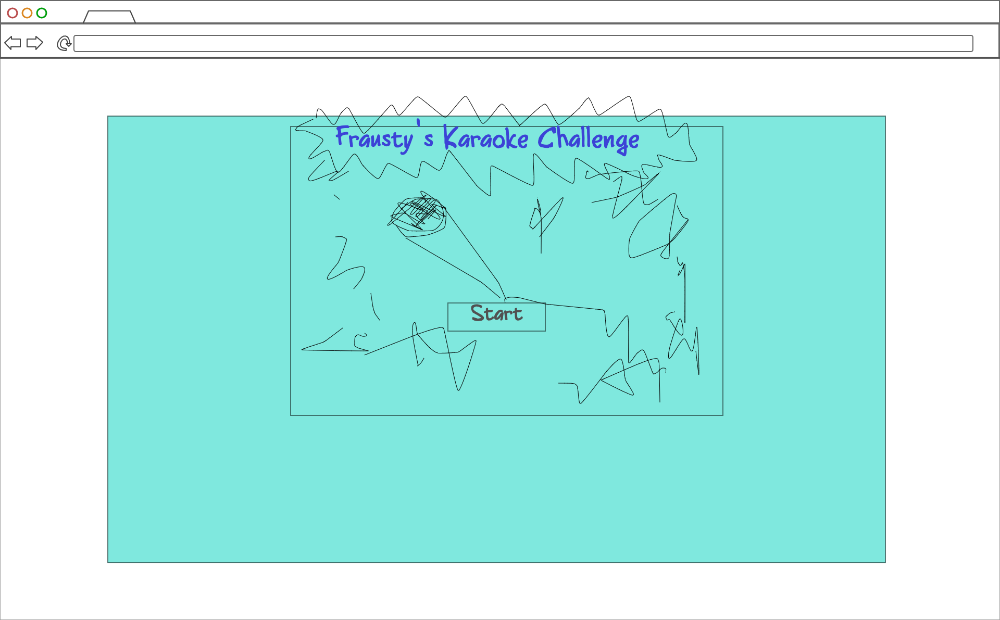
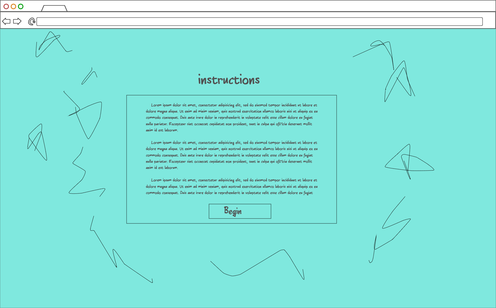
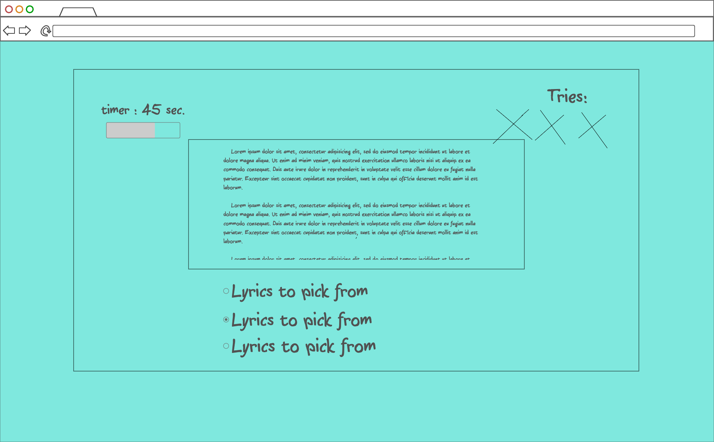
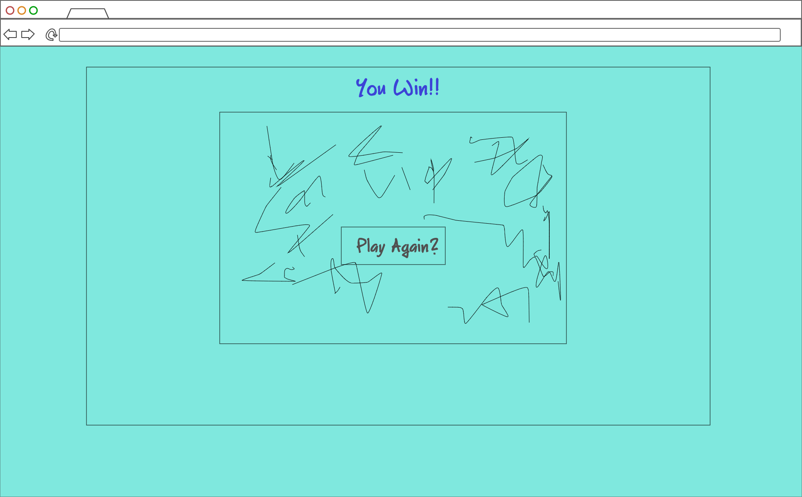
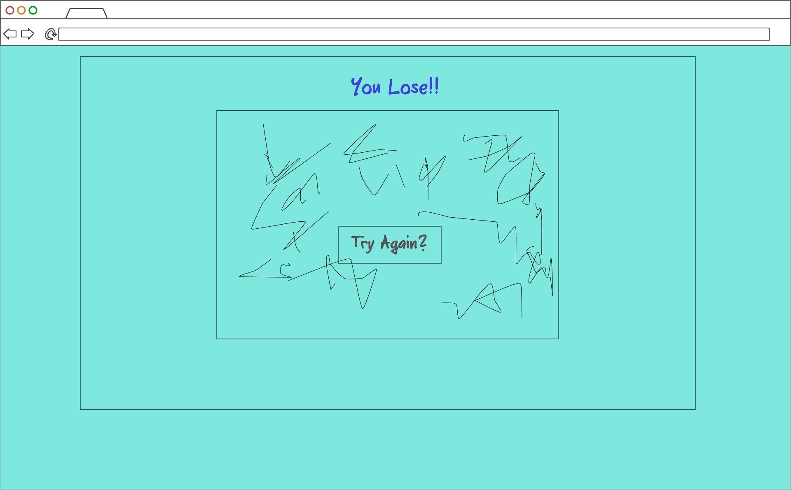

# Project-1-Austin
## First Idea: 'Frausty's Karaoke Challenge'

In this project, I want to do a text based game where the user has to fill in the blanks
or choose the correct answer out of multiple choices.

1. User should be greeted with an opening screen
2. User should see "How to Play" instructions after opening screen
3. User should click start game to play

- There should be clickable (3) options to get the correct line
- a countdown timer (45 secs.)
- 3 tries or strikes before the game ends

## Coding Programs Used:
-HTML
-CSS
-JS
**I may use a framework with a game show design? I have to research what a framework is**

-Start Pic

-Instructions
 

-Gameplay

Win Screen

Lose Screen

